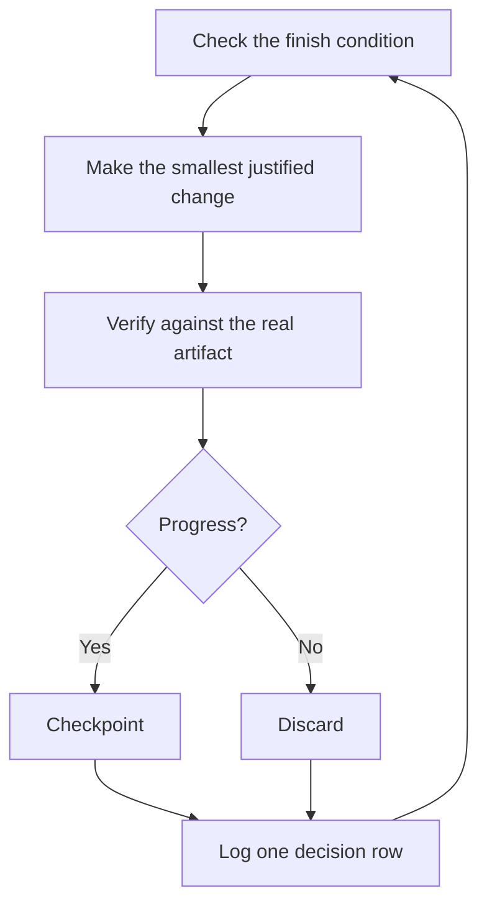

# Run work while you sleep

This is the payoff for everything before it. An agent you can trust to verify
its own work is an agent you can leave with a hard task. What makes that safe
isn't hope. It's a checkable finish condition, isolated files, explicit scope,
and a decision log you can audit later.


## The overnight contract

A good handoff has the goal, the finish condition, the repository scope, and an
escape hatch. It doesn't need to be long:

```text
$poteto-mode im going to bed. migrate every caller to the new parser in a fresh worktree off <base>.
done means zero old callers, all parser fixtures pass, old api deleted.
keep a decision log. commits in that worktree are authorized; do not push or merge.
keep going until done. if you're truly stuck, stop and write up why.
```

Walk through what each line buys you:

- "im going to bed" tells the workflow not to wait for routine preferences it
  can settle from evidence. It does not authorize unrelated or destructive
  actions.
- "done means..." turns the goal into checks every iteration can run.
- "fresh worktree off `<base>`" keeps the run from colliding with anything else
  you have open.
- The authorization line makes the intended Git boundary explicit. Pushing,
  merging, deployment, and other external writes remain out of scope unless
  you request them.
- "keep going until done" is a terminal condition for the active task. It is
  not a scheduling command.
- The escape hatch permits an evidence-backed blocked report instead of quiet
  goal reinterpretation.

Because you'll review this work later, `$poteto-mode` routes it through
[`$figure-it-out`](../../skills/figure-it-out/SKILL.md), which designs the
phases before code and wires in the decision log.

## Active work and recurring monitoring are different

For code the current task can continue working on immediately, the agent stays
in the task, waits for its active subagents, and drives the finish condition to
completion. No timer or shell sleep loop is needed.

Use a Codex heartbeat automation only when you explicitly want the same task to
return later, normally to re-check changing external state such as a PR or CI:

```text
$poteto-mode babysit this pr. check every 30 minutes until it is merge-ready.
```

On a surface that supports task scheduling, pstack can attach that heartbeat
to the current task. Local scheduled work needs the desktop app running and the
computer on. The CLI and IDE extension do not provide the Scheduled management
interface, so create and manage schedules from a supported desktop or web
surface. See [Codex scheduled tasks](https://learn.chatgpt.com/docs/automations).

## What each iteration does



One change, one check, one log row, every iteration. Changes that didn't help
get discarded rather than left to ride. A plateau means pivot, not silently
relax the finish condition.

## The morning audit

[`$show-me-your-work`](../../skills/show-me-your-work/SKILL.md) makes the run
reviewable. Each row records the time, phase, decision, reason, evidence
pointer, and result in `decisions.tsv` (or `.audit/<task-slug>.tsv` when several
runs share a directory). It stays local by default. Commit it only when the
task scope authorizes commits and the trail belongs in review.

When you're back, ask for the run in review form:

```text
$show-me-your-work catch me up on what you did last night
```

The skill checks the trail against the current task record when task-history
tools are available, otherwise against the conversation and tool evidence. It
ends with an Attention section listing what deserves your scrutiny. Read that
section first, then the decision rows it points at.

## When the night holds a queue, not a task

The contract above drives one task to one finish condition. Three heavier
playbooks scale the same trust to queues and programs.

[Autopilot-full](../../skills/poteto-mode/playbooks/autopilot-full.md) runs a
queue of independent PRs through fresh verification. It merges only when your
request explicitly authorizes merging:

```text
$poteto-mode full autopilot on this queue. each item is independent. merge verified prs by morning.
```

[Autopilot-stack](../../skills/poteto-mode/playbooks/autopilot-stack.md) ships
nothing. You get one linear stack with a verifier's verdict on every link:

```text
$poteto-mode autopilot these five changes but stack them, don't ship. i'll land the stack in the morning.
```

[Orchestrate](../../skills/poteto-mode/playbooks/orchestrate.md) is for a
multi-day program with many work units and durable checkpoints. It is heavy
machinery; if one agent can finish in one task, the playbook routes back to the
simpler contract above.

**Pitfall:** a duration is not a finish condition. "work on this for 4 hours"
specifies time spent, not an outcome. Give the task or heartbeat a predicate
that can pass or fail.

Next: [Steer with principle names](./08-principles.md).
